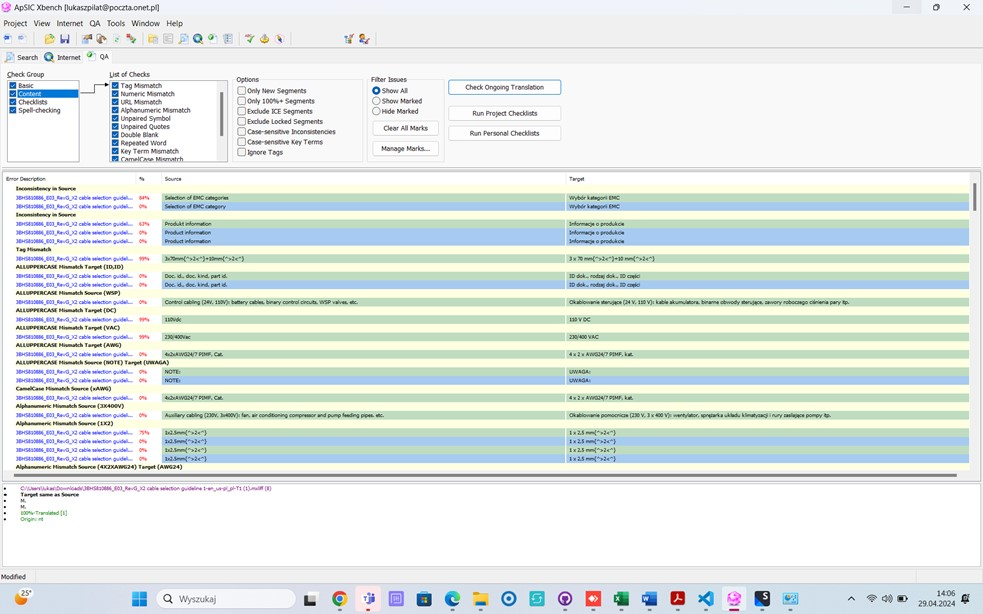

---

title: Useful hints while translating
layout: default
nav_order: 7

---

USEFUL HINTS WHILE TRANSLATING
===============
Now that you have gone through most of the topics, you still may have some doubts and second thoughts. This section aims to answer some of the frequently asked questions, but it is not exhaustive. 
In case you need some more explanations, please do not hesitate to ask your the project manager of the client's side.

Question: I am experiencing some Internet problems, which means I cannnot connect to Xbench in order to perform QA. what should I do?
Answer: No Internet connection does not prevent you from performing a QA. Please note that Trados has an in-built QA module whose features roughly correspond to the functions Xbench provides.
Simply go to the "Review" tab and press the "Verify" buttton. If you feel more comfortable with shortcuts, just press "F8". A pop-up window with a list of detected errors will show up. You can see
a brief description of an issue and, by clicking a specific potential error, you will be directed to a certain row containting potential error. 

The same rule applies to spellcheck. In order to verify if your translation is free of any ortopgraphical shortcomings, go to the "Review" tab and click "Check spelling". The pop-up window will show,
indicating any suspicious instances and giving you some alternatives for correction. In case of any repetitive erros, you are free to correct them all globally by hitting the "Change all" button.

Question: The final Xbench raport contains many errors even though the translation was done very carefully, with a special reference to all the materials provided. How is this possible and should I worry?

Answer: Even though Xbench is a smart and very helpful tool, it is not perfect, which means it can flag several instances as errors even though they are perfectly correct. In order to facilitate your review
of the Xbench report, have a quick look at the possible error sources:

Numbers and Variables: XBench may flag segments containing numbers or variables as potential errors if they deviate slightly from the source text. In some cases the Polish language requires to spell-out numerals. If you do so, Xbench will notify you about 
this discrepancy, as it cannot associate both.

Abbreviations and Acronyms: The technical texts, especially NARS contain many abbreviations that are a commonplace in the industry. Since they are meant to replace a word in the specific language, they will be different. Since Xbench
is programmed to check for consistency, it will automatically flag them as errors. 

Segmentation Issues: XBench might generate the so called "false posiitives" due to segmentation issues, where a single source segment is split into multiple target segments or vice versa. This can occur when sentence boundaries are
ambiguous or when translators use different segmentation preferences for clarify reasons.

In a nutshell, there is no instant solution for those nuisances. You are, instead, strongly advised to carefully (and critically) review all the segments and use your common sense, automatically sorting out the
issues that are perfectly correct in the target language at first glance.

Please cast a look at this example:

It goes without saying that some errors that you can see here are NOT the real ones.
For instance the word NOTE. It is written in uppercase letters as may technical acronyms, which is why Xbench treats it as such. It is, however, an ordinary noun.

Question: May I use machine translation? This would facilitate the translation process and help me get ready with the task even before deadline.

Answer: No. According to the non-disclosure agreement that our company signed you are not allowed to use any third-party translation providers, including machine translation services. Most of the files include sensitive data and
proprietary information that would be revealed to the machine translation system. Moreover, even the most advanced machine translation providers don't mind the context of the entire file, including the segments already translated earlier.

